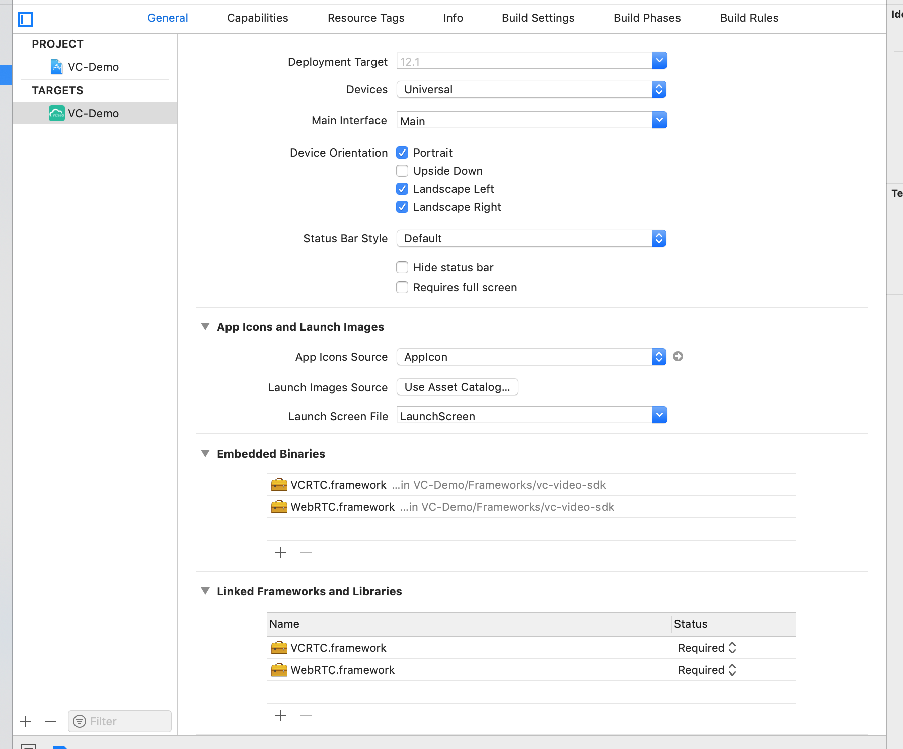
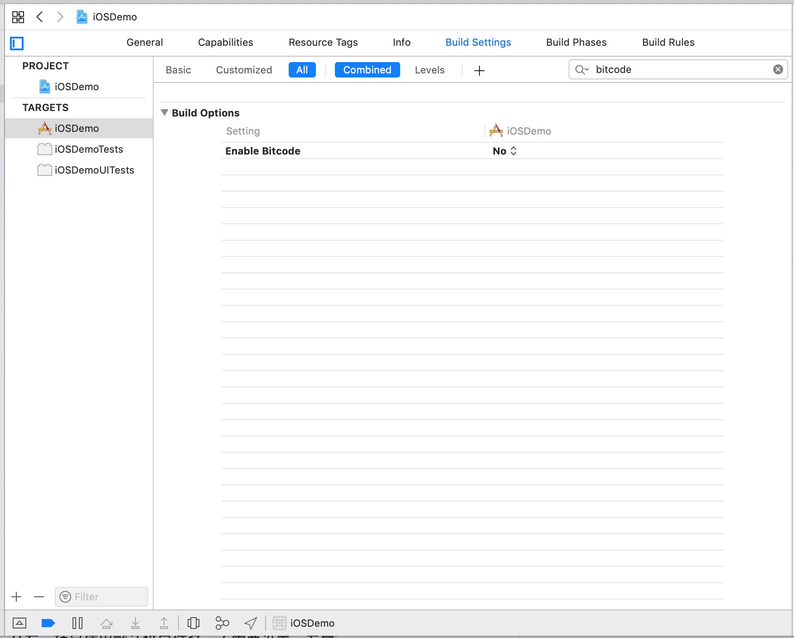

### 前提条件

- `iOS 9.0+`真机 (iPhone或iPad)。
- 请确保你的项目设置有效的开发者签名。
```
注意: 请使用真机运行实例代码,模拟器可能因为功能缺失而无法运行示例代码。
```

### SDK集成说明

- 下载` iOS-SDK `,并解压
- 新建工程,并且添加目录video-sdk中的 `VCRTC.framework` & ` WebRTC.framework` 到工程中

- 确保Embedded Binaries 和 Linked Frameworks and Libraries 中添加 `VCRTC.framework` & `WebRTC.framework`。

- 关闭`bitcode `

- 向 Other Linker Flags 添加 `-ObjC` & `-lc++`

- 在`info.plist` 中 - 添加 麦克风 、相机使用权限


###初始化


```objc

#import <VCRTC/VCRTC.h>

@interface ViewController ()<VCRtcModuleDelegate>
@property (nonatomic, strong) VCRtcModule *vcrtc;
@end

    //初始化
    self.vcrtc = [VCRtcModule sharedInstance];
    //配置服务器域名
    self.vcrtc.apiServer = @"服务器域名";
    //遵循 VCRtcModuleDelegate方法
    self.vcrtc.delegate = self;
   
```

初始化参数设置

```objc   
    //入会类型配置
    //入会类型配置
    [self.vcrtc configConnectType:VCConnectTypeMeeting];
    //入会音视频质量配置
    [self.vcrtc configVideoProfile:VCVideoProfile480P];
    //入会接收流的方式配置
    [self.vcrtc configMultistream:YES];
    //用户账号配置(用户登录需配置,未登录不需要)
    [self.vcrtc configLoginAccount:@"登录账号"];


```
### 加入会议

```objc
  
[self.vcrtc connectChannel:@"会议室/用户地址" password:@"参会密码" name:@"会中显示名称" success:^(id _Nonnull response) {
        
    } failure:^(NSError * _Nonnull error) {
 
    }];
```

### 接收回调信息

```objc
#pragma mark - VCRtcModuleDelegate 接收会中音视频处理
//接收本地视频
- (void)VCRtc:(VCRtcModule *)module didAddLocalView:(VCVideoView *)view {
    
    view.frame = self.view.frame;
    self.localView = view;
    view.objectFit = VCVideoViewObjectFitCover;
    [self.view addSubview:view];
    [self.view bringSubviewToFront:self.othersView];
    [self.view bringSubviewToFront:self.buttonsView];
    
}
// 接收远端视频
- (void)VCRtc:(VCRtcModule *)module didAddView:(VCVideoView *)view uuid:(NSString *)uuid {
    //只处理了3个远端视频
    if (![self.farEndViewsArray containsObject:view] && self.farEndViewsArray.count < 3) {
        [self.farEndViewsArray addObject:view];
        [self layoutFarEndView];
    }
}
//删除远端视频
- (void)VCRtc:(VCRtcModule *)module didRemoveView:(VCVideoView *)view uuid:(NSString *)uuid {
    [view removeFromSuperview];
    [self.farEndViewsArray removeObject:view];
    [self layoutFarEndView];
}
/** 远端视频布局 */
- (void)layoutFarEndView {
    CGFloat viewWidth = 100;
    CGFloat viewHeight = 128;
    for (NSInteger i = 0 ; i < self.farEndViewsArray.count; i++) {
        VCVideoView *subView = self.farEndViewsArray[i];
        [self.othersView addSubview:subView];
        subView.objectFit = VCVideoViewObjectFitCover;
        subView.frame = CGRectMake(i * viewWidth, 0, viewWidth, viewHeight);
    }
}
//连接失败
- (void)VCRtc:(VCRtcModule *)module didDisconnectedWithReason:(NSError *)reason {
}
```

### 离开会议

```objc
    [self.vcrtc exitChannelSuccess:^(id  _Nonnull response) {
        for (VCVideoView *subView in self.farEndViewsArray) {
            [subView removeFromSuperview];
        }
        [self.farEndViewsArray removeAllObjects];
        [self.localView removeFromSuperview];
    } failure:^(NSError * _Nonnull error) {
    }];
```

